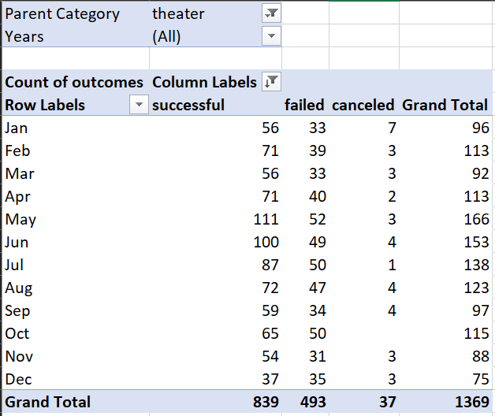
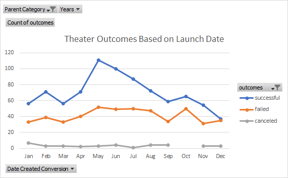
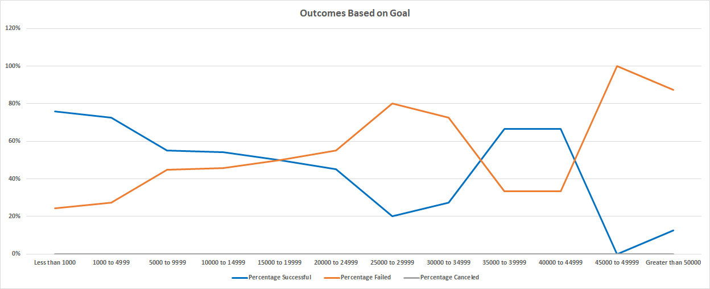
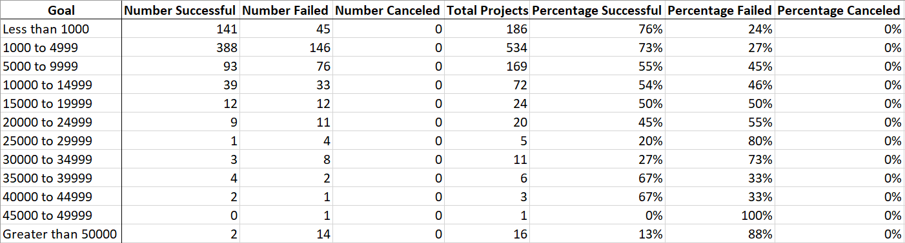

# Kickstarting with Excel

## Overview of Project

### Purpose
Louise is a playwright who is passionate about creating theatrical productions that engage her viewers through various themes highlighting the human condition. The depth of her projects knows no bounds, and due to the nature of the industry, she wants to bring her creative work to life via crowdfunding. Louise is trying to start a fundraising campaign to fund her play, Fever, with an estimated budget of $10,000-$12,000. She has given us the task to analyze over 4000 campaigns extracted from Kickstarter to uncover trends, mainly to uncover the attributes of successful campaigns and what sets them apart from the rest. What is the makeup of a successful campaign, and how can we emulate those campaigns that succeeded expectations? We specifically want to filter out the Kickstarter projects that pertain to theatrical plays so we may dissect them for further analysis. Louise would like us to determine which factors are significant to improve her campaign's chances of being successful.
## Analysis and Challenges

### Analysis of Outcomes Based on Launch Date
To create the Outcomes Based on Launch Date graph, I selected all the data in the Kickstarter sheet, and then I navigated to the “insert pivot chart” option on the top ribbon of excel. I specified the pivot table fields by dragging the outcomes to the columns section, date-created conversion to the rows section, and the outcomes to the values section. I also added the years and parent category to the filters section to specify the data of interest. I applied theater to the parent category filter to only view the successful, failed, canceled, and totals for theater campaigns. The chart updated simultaneously to reflect the changes in the filter option. These are the resulting table and line graph:

 

### Analysis of Outcomes Based on Goals
Using the COUNTIFS function, I propagated the new table created in the “Outcomes Based on Goals” sheet by specifying the columns of interest in the Kickstarter sheet the criteria necessary to reflect the amounts of each interval. For example, in the cell containing the amount of failed campaigns with a goal between $25,000 to 29,999, I used the following COUNTIFS function:

**=COUNTIFS(Kickstarter!D:D,">=25000",Kickstarter!D:D,"<=29999",Kickstarter!F:F,"=failed",Kickstarter!R:R,"plays")**

After successfully applying the COUNTIFS function to the number successful, number failed, and number canceled columns, I calculated the total projects in each interval and the respective percentages for each outcome. I created a line graph by selecting all the data and then navigating to the insert line chart option on the excel ribbon. I specified the legend series data to be the percentage successful, percentage failed, and the percentage canceled. For the horizontal axis, I set the intervals to be the labels in the select data window. The resulting graph was displayed:

### Challenges and Difficulties Encountered
Whenever I initially used the **COUNTIFS** function for the Outcomes Based on Goals chart, I navigated to the Kickstarter sheet and used the column filters to filter out the data I wanted to extract, beginning with the successful data, then I applied the **COUNTIFS** function. The initial function I created was the following: 

**=COUNTIFS(Kickstarter!D:D," <1000",Kickstarter!F:F)**

The resulting output was 461 successful projects. At first glance, it appears that the function works properly, so I continued to use the same format in the following row to find the number of successful campaigns with a goal between $1,000 and $4,999 with the following function:

**=COUNTIFS(Kickstarter!D:D,">=1000",Kickstarter!D:D,"<=4999")**

I quickly realized that something was off. The function above returned 1425 campaigns with a goal between $1,000 and $4,999. The results seemed too large, so I went back to the Kickstarter sheet to determine the number of rows of the data with the "successful" and "plays" filters active. The Kickstarter sheet's bottom-left displayed 412 of 4114 records found, translating to 412 rows of data present:

  

Since the faulty function I used returned 1425 campaigns, the function counted all campaigns with a goal between $1,000 and $4,999 or 1425 rows of data. I asked myself how can there be 1425 successful theatrical play campaigns with a goal between $1,000 and $4,999 when there are only 412 rows of data present in the Kickstarter sheet with the "plays" and "successful" filter active? After careful consideration, I realized the **COUNTIFS** function was returning all goals with the criteria I inserted regardless of if they were successful or plays. The active column filters were not enough. I had to specify all the criteria in the **COUNTIFS** function explicitly, so I updated the faulty functions to the following:

**=COUNTIFS(Kickstarter!D:D,"<1000",Kickstarter!F:F,"=successful",Kickstarter!R:R,"plays")**

**=COUNTIFS(Kickstarter!D:D,">=1000",Kickstarter!D:D,"<=4999",Kickstarter!F:F,"=successful",Kickstarter!R:R,"plays")**

After resolving the issue, I continued to apply the **COUNTIFS** function to the rows and columns that followed with the updated formulas specifying all the necessary criteria.

## Results

Based on the Outcomes Based on Launch Date graph, the months of January, March, and September have similar successful and failed outcomes based on the graph. The graph spikes upward on the month of May with regards to successful outcomes. May is the best month of the year to launch a theater campaign. December seems to be the worst month to launch a campaign. The amount of successful and failed campaigns is roughly the same during the month of December since both lines representing the successful and failed campaigns appear to connect. As a result, the rate of success is the lowest during the month of December.

If we look at the Outcomes based on Goals graph, the success rate is initially higher than the rate of failed outcomes for plays with goals between $0-$14,999, up until the goals reach $15,000-$19,000. At this point, the lines for success rate and failure rate intersect. The intersection point shows that the rate of success and the rate of failure are the same, and as the goal amounts get higher past this point, the failure rate becomes more than the success rate. The failure rate is higher than the success rate until we reach the interval goals between $35,000-$39,000 and $40,000-$44,999. As the goals increase past that point, the failure rate overtakes the success rate once again. 

A possible issue worth noting about the data we are working with is that we are only limiting our fundraising data to the Kickstarter platform. Perhaps we could examine other crowdsourcing platforms, and we can compare them based on the success rate for theatrical play campaigns. We could look at data from Indiegogo, or more appropriately, crowdfunding platforms dedicated to theater. Kickstarter seems to be for general use fundraising considering the abundant campaigns in tech, hardware, and other unrelated projects. We could also get more specific by singling out plays based on their genre to find projects similar in genre to the play Louise is trying to produce.

We could use a box plot to get a visualization of the goal distribution and detect potential outliers. If we look at the Outcomes Based on Goal graph and its respective chart, we can see some intervals with significantly higher goals where the success rates are higher than the failure rate. If we look at those questionable intervals ($35,000-$39,000 and $40,000-$44,999), we see a total of nine projects, with 67% of those campaigns being successful. Those goals may not be an accurate representation of successful goals. Since Louise is asking for way less, we might need to disregard those significantly higher successful goals from our analysis. By creating a box plot, we can determine if those questionable successful goals are outliers.
